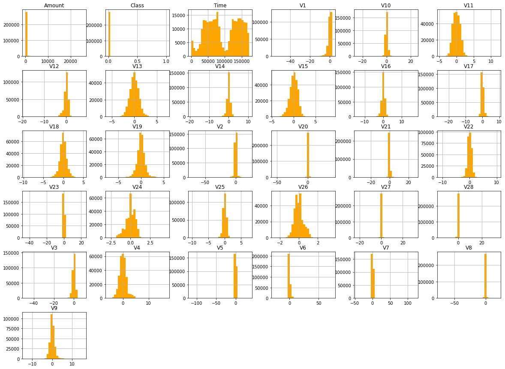
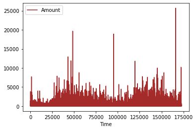
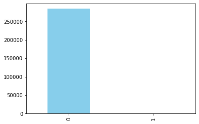
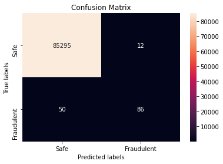
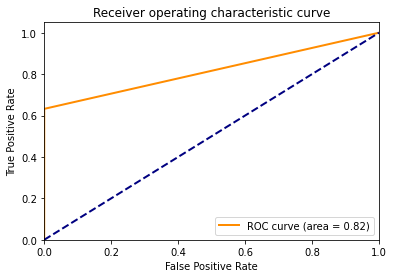
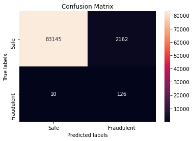
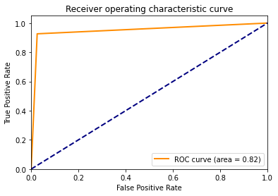
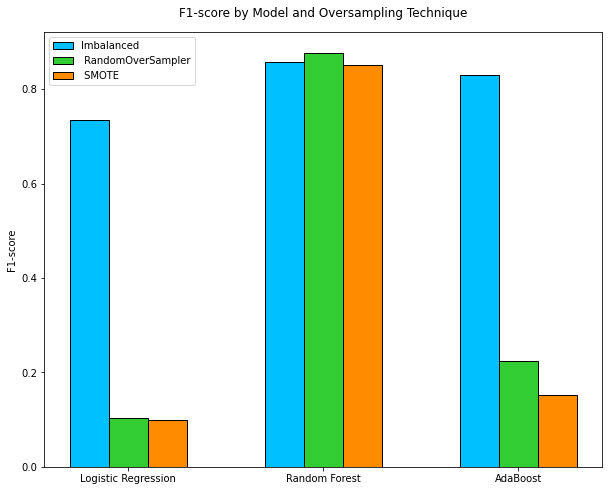

# Credit Card Fraud Detection

## Synopsis

Credit card companies handle numerous credit card transactions each day and there could be some cases of fraudulent transactions, where customers are charged for items they did not purchase. As such, it is important for companies to detect these fraudulent transactions to improve customer security and build up customer confidence in the company. In this project, we will explore some methods to resolve data imbalance and use logistic regression, random forest and adaboost to classify the transactions as safe or fraudulent.

## Data

The dataset is taken from [Kaggle](https://www.kaggle.com/mlg-ulb/creditcardfraud). It contains transactions made by credit cards in September 2013 by European cardholders. Due to confidentiality issues, Kaggle is unable to provide the original features and more background information about the data. Features V1, V2, … V28 are the principal components obtained with PCA, the only features which have not been transformed with PCA are 'Time' and 'Amount'. Feature 'Time' contains the seconds elapsed between each transaction and the first transaction in the dataset. The feature 'Amount' is the transaction amount. The feature 'Class' is the response variable and it takes value 1 in case of fraud and 0 otherwise.

## Loading in the Data

Load in the libraries.


```python
import numpy as np
import pandas as pd
import matplotlib.pyplot as plt
import seaborn as sns

%matplotlib inline
```


```python
from sklearn.preprocessing import StandardScaler
from sklearn.model_selection import train_test_split
from sklearn.linear_model import LogisticRegression
from sklearn.metrics import confusion_matrix, classification_report, roc_curve, auc, accuracy_score, precision_score, recall_score, f1_score
from sklearn.ensemble import RandomForestClassifier, AdaBoostClassifier

from imblearn.over_sampling import RandomOverSampler
from imblearn.over_sampling import SMOTE
```

Load in the csv file and check its first few rows.


```python
credit = pd.read_csv("creditcard.csv")
```


```python
credit.head()
```


<div>
<style scoped>
    .dataframe tbody tr th:only-of-type {
        vertical-align: middle;
    }

    .dataframe tbody tr th {
        vertical-align: top;
    }

    .dataframe thead th {
        text-align: right;
    }
</style>
<table border="1" class="dataframe">
  <thead>
    <tr style="text-align: right;">
      <th></th>
      <th>Time</th>
      <th>V1</th>
      <th>V2</th>
      <th>V3</th>
      <th>V4</th>
      <th>V5</th>
      <th>V6</th>
      <th>V7</th>
      <th>V8</th>
      <th>V9</th>
      <th>...</th>
      <th>V21</th>
      <th>V22</th>
      <th>V23</th>
      <th>V24</th>
      <th>V25</th>
      <th>V26</th>
      <th>V27</th>
      <th>V28</th>
      <th>Amount</th>
      <th>Class</th>
    </tr>
  </thead>
  <tbody>
    <tr>
      <th>0</th>
      <td>0.0</td>
      <td>-1.359807</td>
      <td>-0.072781</td>
      <td>2.536347</td>
      <td>1.378155</td>
      <td>-0.338321</td>
      <td>0.462388</td>
      <td>0.239599</td>
      <td>0.098698</td>
      <td>0.363787</td>
      <td>...</td>
      <td>-0.018307</td>
      <td>0.277838</td>
      <td>-0.110474</td>
      <td>0.066928</td>
      <td>0.128539</td>
      <td>-0.189115</td>
      <td>0.133558</td>
      <td>-0.021053</td>
      <td>149.62</td>
      <td>0</td>
    </tr>
    <tr>
      <th>1</th>
      <td>0.0</td>
      <td>1.191857</td>
      <td>0.266151</td>
      <td>0.166480</td>
      <td>0.448154</td>
      <td>0.060018</td>
      <td>-0.082361</td>
      <td>-0.078803</td>
      <td>0.085102</td>
      <td>-0.255425</td>
      <td>...</td>
      <td>-0.225775</td>
      <td>-0.638672</td>
      <td>0.101288</td>
      <td>-0.339846</td>
      <td>0.167170</td>
      <td>0.125895</td>
      <td>-0.008983</td>
      <td>0.014724</td>
      <td>2.69</td>
      <td>0</td>
    </tr>
    <tr>
      <th>2</th>
      <td>1.0</td>
      <td>-1.358354</td>
      <td>-1.340163</td>
      <td>1.773209</td>
      <td>0.379780</td>
      <td>-0.503198</td>
      <td>1.800499</td>
      <td>0.791461</td>
      <td>0.247676</td>
      <td>-1.514654</td>
      <td>...</td>
      <td>0.247998</td>
      <td>0.771679</td>
      <td>0.909412</td>
      <td>-0.689281</td>
      <td>-0.327642</td>
      <td>-0.139097</td>
      <td>-0.055353</td>
      <td>-0.059752</td>
      <td>378.66</td>
      <td>0</td>
    </tr>
    <tr>
      <th>3</th>
      <td>1.0</td>
      <td>-0.966272</td>
      <td>-0.185226</td>
      <td>1.792993</td>
      <td>-0.863291</td>
      <td>-0.010309</td>
      <td>1.247203</td>
      <td>0.237609</td>
      <td>0.377436</td>
      <td>-1.387024</td>
      <td>...</td>
      <td>-0.108300</td>
      <td>0.005274</td>
      <td>-0.190321</td>
      <td>-1.175575</td>
      <td>0.647376</td>
      <td>-0.221929</td>
      <td>0.062723</td>
      <td>0.061458</td>
      <td>123.50</td>
      <td>0</td>
    </tr>
    <tr>
      <th>4</th>
      <td>2.0</td>
      <td>-1.158233</td>
      <td>0.877737</td>
      <td>1.548718</td>
      <td>0.403034</td>
      <td>-0.407193</td>
      <td>0.095921</td>
      <td>0.592941</td>
      <td>-0.270533</td>
      <td>0.817739</td>
      <td>...</td>
      <td>-0.009431</td>
      <td>0.798278</td>
      <td>-0.137458</td>
      <td>0.141267</td>
      <td>-0.206010</td>
      <td>0.502292</td>
      <td>0.219422</td>
      <td>0.215153</td>
      <td>69.99</td>
      <td>0</td>
    </tr>
  </tbody>
</table>
<p>5 rows × 31 columns</p>
</div>


```python
credit.shape
```


    (284807, 31)


## Exploratory Data Analysis

Plot a histogram for each column to check their distributions.


```python
credit.hist(bins=30, figsize=(20, 15), color='orange');
```





Plot the transaction amounts over time.


```python
credit[['Time','Amount']].set_index('Time').plot(kind='line', color='brown')
```


    <matplotlib.axes._subplots.AxesSubplot at 0x7f853927b610>





## Data Cleaning

Normalize the 'Amount' column and 'Time' column.


```python
credit['norm_amount'] = StandardScaler().fit_transform(credit['Amount'].values.reshape(-1, 1))
credit['norm_time'] = StandardScaler().fit_transform(credit['Time'].values.reshape(-1, 1))
credit.drop(['Time','Amount'],axis=1, inplace=True)
```


```python
credit.head()
```


<div>
<style scoped>
    .dataframe tbody tr th:only-of-type {
        vertical-align: middle;
    }

    .dataframe tbody tr th {
        vertical-align: top;
    }

    .dataframe thead th {
        text-align: right;
    }
</style>
<table border="1" class="dataframe">
  <thead>
    <tr style="text-align: right;">
      <th></th>
      <th>V1</th>
      <th>V2</th>
      <th>V3</th>
      <th>V4</th>
      <th>V5</th>
      <th>V6</th>
      <th>V7</th>
      <th>V8</th>
      <th>V9</th>
      <th>V10</th>
      <th>...</th>
      <th>V22</th>
      <th>V23</th>
      <th>V24</th>
      <th>V25</th>
      <th>V26</th>
      <th>V27</th>
      <th>V28</th>
      <th>Class</th>
      <th>norm_amount</th>
      <th>norm_time</th>
    </tr>
  </thead>
  <tbody>
    <tr>
      <th>0</th>
      <td>-1.359807</td>
      <td>-0.072781</td>
      <td>2.536347</td>
      <td>1.378155</td>
      <td>-0.338321</td>
      <td>0.462388</td>
      <td>0.239599</td>
      <td>0.098698</td>
      <td>0.363787</td>
      <td>0.090794</td>
      <td>...</td>
      <td>0.277838</td>
      <td>-0.110474</td>
      <td>0.066928</td>
      <td>0.128539</td>
      <td>-0.189115</td>
      <td>0.133558</td>
      <td>-0.021053</td>
      <td>0</td>
      <td>0.244964</td>
      <td>-1.996583</td>
    </tr>
    <tr>
      <th>1</th>
      <td>1.191857</td>
      <td>0.266151</td>
      <td>0.166480</td>
      <td>0.448154</td>
      <td>0.060018</td>
      <td>-0.082361</td>
      <td>-0.078803</td>
      <td>0.085102</td>
      <td>-0.255425</td>
      <td>-0.166974</td>
      <td>...</td>
      <td>-0.638672</td>
      <td>0.101288</td>
      <td>-0.339846</td>
      <td>0.167170</td>
      <td>0.125895</td>
      <td>-0.008983</td>
      <td>0.014724</td>
      <td>0</td>
      <td>-0.342475</td>
      <td>-1.996583</td>
    </tr>
    <tr>
      <th>2</th>
      <td>-1.358354</td>
      <td>-1.340163</td>
      <td>1.773209</td>
      <td>0.379780</td>
      <td>-0.503198</td>
      <td>1.800499</td>
      <td>0.791461</td>
      <td>0.247676</td>
      <td>-1.514654</td>
      <td>0.207643</td>
      <td>...</td>
      <td>0.771679</td>
      <td>0.909412</td>
      <td>-0.689281</td>
      <td>-0.327642</td>
      <td>-0.139097</td>
      <td>-0.055353</td>
      <td>-0.059752</td>
      <td>0</td>
      <td>1.160686</td>
      <td>-1.996562</td>
    </tr>
    <tr>
      <th>3</th>
      <td>-0.966272</td>
      <td>-0.185226</td>
      <td>1.792993</td>
      <td>-0.863291</td>
      <td>-0.010309</td>
      <td>1.247203</td>
      <td>0.237609</td>
      <td>0.377436</td>
      <td>-1.387024</td>
      <td>-0.054952</td>
      <td>...</td>
      <td>0.005274</td>
      <td>-0.190321</td>
      <td>-1.175575</td>
      <td>0.647376</td>
      <td>-0.221929</td>
      <td>0.062723</td>
      <td>0.061458</td>
      <td>0</td>
      <td>0.140534</td>
      <td>-1.996562</td>
    </tr>
    <tr>
      <th>4</th>
      <td>-1.158233</td>
      <td>0.877737</td>
      <td>1.548718</td>
      <td>0.403034</td>
      <td>-0.407193</td>
      <td>0.095921</td>
      <td>0.592941</td>
      <td>-0.270533</td>
      <td>0.817739</td>
      <td>0.753074</td>
      <td>...</td>
      <td>0.798278</td>
      <td>-0.137458</td>
      <td>0.141267</td>
      <td>-0.206010</td>
      <td>0.502292</td>
      <td>0.219422</td>
      <td>0.215153</td>
      <td>0</td>
      <td>-0.073403</td>
      <td>-1.996541</td>
    </tr>
  </tbody>
</table>
<p>5 rows × 31 columns</p>
</div>


## Data Imbalance

We count the number of each class as follows:


```python
class_count = credit['Class'].value_counts()
class_count
```


    0    284315
    1       492
    Name: Class, dtype: int64


```python
class_count.plot(kind = 'bar', color='skyblue')
```


    <matplotlib.axes._subplots.AxesSubplot at 0x7f84e8a35dc0>





From the values and plot, there appears to be severe data imbalance. Very few transactions are fraudulent while most of the transactions are safe. This needs to be resolved as predictive models developed using conventional machine learning algorithms could be biased and inaccurate. Such models would have a bias towards classes which have a high number of instances, such as in this case, safe transactions. These models would tend to predict the transactions as safe and treat the fraudulent transactions as noise. Thus, there would be a high probability of misclassification of fraudulent transactions as safe, which is definitely not ideal.

One of the ways to resolve data imbalance is to resample the dataset. This can be done by undersampling or oversampling. In this case, we will use oversampling as undersampling would result in too little data.

## Oversampling

Two different oversampling techniques will be tested. They are:

- RandomOverSampler
- SMOTE (Synthetic Minority Oversampling Technique)

Split the data into training and test sets. Note that we only perform oversampling after data splitting and on the training data so that no information will from the test data will be used in model training.


```python
# Remove 'Class' column
output_var = credit['Class']
credit.drop('Class', axis=1, inplace=True)
# Split the data
x_train, x_test, y_train, y_test = train_test_split(credit, output_var, test_size=0.3, random_state=42)
```

### RandomOverSampler

RandomOverSampler involves oversampling the minority class by picking samples at random with replacement. We are going to check the number of rows before and after sampling.


```python
# Check number of rows before oversampling
print("Before OverSampling, counts of label '1': {}".format(sum(y_train==1)))
print("Before OverSampling, counts of label '0': {} \n".format(sum(y_train==0)))
```

    Before OverSampling, counts of label '1': 356
    Before OverSampling, counts of label '0': 199008 
    


```python
# Apply RandomOverSampler
over_sample = RandomOverSampler(random_state=42)
x_train_ros, y_train_ros = over_sample.fit_resample(x_train, y_train.ravel())
# Check number of rows after oversampling
print("After OverSampling, counts of label '1': {}".format(sum(y_train_ros==1)))
print("After OverSampling, counts of label '0': {} \n".format(sum(y_train_ros==0))) 
```

    After OverSampling, counts of label '1': 199008
    After OverSampling, counts of label '0': 199008 
    


### SMOTE (Synthetic Minority Oversampling Technique)

SMOTE first selects a minority class instance 'a' at random and finds its k nearest minority class neighbors. The synthetic instance is then created by choosing one of the k nearest neighbors 'b' at random and connecting 'a' and 'b' to form a line segment. The synthetic instances are generated as a convex combination of the two chosen instances 'a' and 'b'. 


```python
# Apply SMOTE
over_sample = SMOTE(random_state=42)
x_train_smote, y_train_smote = over_sample.fit_resample(x_train, y_train.ravel())
# Check number of rows after oversampling
print("After OverSampling, counts of label '1': {}".format(sum(y_train_smote==1)))
print("After OverSampling, counts of label '0': {} \n".format(sum(y_train_smote==0))) 
```

    After OverSampling, counts of label '1': 199008
    After OverSampling, counts of label '0': 199008 
    


## Model Building

The following models have been chosen for building:

- Logistic Regression
- Random Forest
- Adaboost

### Logistic Regression

Logistic Regression is a classification algorithm that is used to predict the probability of a categorical dependent variable. In logistic regression, the dependent variable is a binary variable that contains data coded as 1 or 0, or in this case, fraudulent or safe.

The model will first be run on the imbalanced data, followed by  the data after oversampling (RandomOverSampler and SMOTE). 

### 1) Logistic Regression on imbalanced dataset

Fit the training data into logistic regression and use the model to predict on the test data.


```python
lg = LogisticRegression()
lg.fit(x_train, y_train)

y_pred_lg = lg.predict(x_test)
```

To evaluate the model, we can plot a confusion matrix. A confusion matrix is a table that is often used to describe the performance of a classification model. It shows the number of true positives, true negatives, false positives and false negatives.

**True Positives (TP)** - Actual class is 1 and predicted class is 1 (safe transactions accurately classified as safe)

**True Negatives (TN)** - Actual class is 0 and predicted class is 0 (fraudulent transactions accurately classified as fraudulent)

**False Positives (FP)** - Actual class is 0 but predicted class is 1 (safe transactions wrongly classified as fraudulent)

**False Negatives (FN)** - Actual class is 1 but predicted class is 0 (fraudulent transactions wrongly classified as safe)


```python
cm = confusion_matrix(y_test, y_pred_lg)

# Create graphics for confusion matrix
labels = ['Safe','Fraudulent']
ax= plt.subplot()
sns.heatmap(cm, annot=True, ax = ax, fmt="d"); 

# Labels, title and ticks
ax.set_xlabel('Predicted labels');ax.set_ylabel('True labels'); 
ax.set_title('Confusion Matrix'); 
ax.xaxis.set_ticklabels(labels); ax.yaxis.set_ticklabels(labels)
plt.show()
```





There appears to be a large number of transactions classified correctly as safe or fraudulent. However, there are 50 false negatives, i.e. fraudulent transactions that were predicted as safe, which the model needs to improve on.

Since this is an imbalanced dataset, we print out the classification report, which shows the accuracy, precision, recall, f1 score and support of the model.

**Accuracy** - Ratio of correctly predicted observations to the total observations, i.e. TP+TN/TP+FP+FN+TN

**Precision** - Ratio of correctly predicted positive observations to the total predicted positive observations, i.e. TP/TP+FP

**Recall** - Ratio of correctly predicted positive observations to all the observations in positive class, i.e. TP/TP+FN

**F1 score** - Weighted average of precision and recall, usually more useful than accuracy, especially if you have an uneven class distribution, i.e 2*(Recall * Precision) / (Recall + Precision)

**Support** - Number of actual occurrences of the class in the dataset


```python
print(classification_report(y_test, y_pred_lg, digits=5))
```

                  precision    recall  f1-score   support
    
               0    0.99941   0.99986   0.99964     85307
               1    0.87755   0.63235   0.73504       136
    
        accuracy                        0.99927     85443
       macro avg    0.93848   0.81611   0.86734     85443
    weighted avg    0.99922   0.99927   0.99922     85443
    


The model has a precision of 0.88, recall of 0.63 and f1 score of 0.73, which shows that the model does relatively well.

Now, we plot a Receiver Operating Characteristic (ROC) curve. It plots the true positive rate (TPR) versus the false positive rate (FPR) as a function of the model’s threshold for classifying a positive. We then proceed to compute the Area under the curve (AUC), which is a metric to calculate the overall performance of a classification model based on area under the ROC curve.


```python
# Get false positive rate and true positive rate
fpr, tpr, _ = roc_curve(y_test, y_pred_lg)
roc_auc = auc(fpr, tpr)

# Plot ROC curve
plt.figure()
plt.plot(fpr, tpr, color='darkorange',
         lw=2, label='ROC curve (area = %0.2f)' % roc_auc)
plt.plot([0, 1], [0, 1], color='navy', lw=2, linestyle='--')
plt.xlim([0.0, 1.0])
plt.ylim([0.0, 1.05])
plt.xlabel('False Positive Rate')
plt.ylabel('True Positive Rate')
plt.title('Receiver operating characteristic curve')
plt.legend(loc="lower right")
plt.show()
```





### 2) Logistic Regression on oversampled dataset (RandomOverSampler)


```python
lg_ros = LogisticRegression()
lg_ros.fit(x_train_ros, y_train_ros)

y_pred_lg_ros = lg_ros.predict(x_test)
```


```python
cm = confusion_matrix(y_test, y_pred_lg_ros)

# Create graphics for confusion matrix
labels = ['Safe','Fraudulent']
ax= plt.subplot()
sns.heatmap(cm, annot=True, ax = ax, fmt="d"); 

# Labels, title and ticks
ax.set_xlabel('Predicted labels');ax.set_ylabel('True labels'); 
ax.set_title('Confusion Matrix'); 
ax.xaxis.set_ticklabels(labels); ax.yaxis.set_ticklabels(labels)
plt.show()
```





There appears to be 10 false negatives, which is much lower than the unbalanced dataset. However, there are significantly more false positives.


```python
print(classification_report(y_test, y_pred_lg_ros, digits=5))
```

                  precision    recall  f1-score   support
    
               0    0.99988   0.97466   0.98711     85307
               1    0.05507   0.92647   0.10396       136
    
        accuracy                        0.97458     85443
       macro avg    0.52747   0.95056   0.54553     85443
    weighted avg    0.99838   0.97458   0.98570     85443
    


As expected, it has a low precision of 0.05 but a high recall of 0.93.


```python
# Get false positive rate and true positive rate
fpr, tpr, _ = roc_curve(y_test, y_pred_lg_ros)
roc_auc_ros = auc(fpr, tpr)

# Plot ROC curve
plt.figure()
plt.plot(fpr, tpr, color='darkorange',
         lw=2, label='ROC curve (area = %0.2f)' % roc_auc)
plt.plot([0, 1], [0, 1], color='navy', lw=2, linestyle='--')
plt.xlim([0.0, 1.0])
plt.ylim([0.0, 1.05])
plt.xlabel('False Positive Rate')
plt.ylabel('True Positive Rate')
plt.title('Receiver operating characteristic curve')
plt.legend(loc="lower right")
plt.show()
```





### 3) Logistic Regression on oversampled dataset (SMOTE)


```python
lg_smote = LogisticRegression()
lg_smote.fit(x_train_smote, y_train_smote)

y_pred_lg_smote = lg_smote.predict(x_test)
```


```python
cm = confusion_matrix(y_test, y_pred_lg_smote)

# Create graphics for confusion matrix
labels = ['Safe','Fraudulent']
ax= plt.subplot()
sns.heatmap(cm, annot=True, ax = ax, fmt="d"); 

# Labels, title and ticks
ax.set_xlabel('Predicted labels');ax.set_ylabel('True labels'); 
ax.set_title('Confusion Matrix'); 
ax.xaxis.set_ticklabels(labels); ax.yaxis.set_ticklabels(labels)
plt.show()
```


It has quite similar false negatives to the oversampled data using RandomOverSampler but higher false positives.


```python
print(classification_report(y_test, y_pred_lg_smote, digits=5))
```

                  precision    recall  f1-score   support
    
               0    0.99989   0.97331   0.98642     85307
               1    0.05283   0.93382   0.10000       136
    
        accuracy                        0.97325     85443
       macro avg    0.52636   0.95357   0.54321     85443
    weighted avg    0.99838   0.97325   0.98501     85443
    


```python
# Get false positive rate and true positive rate
fpr, tpr, _ = roc_curve(y_test, y_pred_lg_smote)
roc_auc_smote = auc(fpr, tpr)

# Plot ROC curve
plt.figure()
plt.plot(fpr, tpr, color='darkorange',
         lw=2, label='ROC curve (area = %0.2f)' % roc_auc)
plt.plot([0, 1], [0, 1], color='navy', lw=2, linestyle='--')
plt.xlim([0.0, 1.0])
plt.ylim([0.0, 1.05])
plt.xlabel('False Positive Rate')
plt.ylabel('True Positive Rate')
plt.title('Receiver operating characteristic curve')
plt.legend(loc="lower right")
plt.show()
```


The 3 methods have similar AUC scores.

### Random Forest

Random forest builds multiple decision trees and merges them together to get a more accurate and stable prediction. It is usually trained with the “bagging” method, where a combination of learning models is used to increase the overall result.

### 1) Random Forest on imbalanced dataset

Fit the training data into random forest and use the model to predict on the test data.


```python
rf = RandomForestClassifier(n_estimators = 100, random_state = 42)
rf.fit(x_train,y_train)
y_pred_rf =rf.predict(x_test)
```


```python
print(classification_report(y_test, y_pred_rf, digits=5))
```

                  precision    recall  f1-score   support
    
               0    0.99968   0.99989   0.99979     85307
               1    0.92373   0.80147   0.85827       136
    
        accuracy                        0.99958     85443
       macro avg    0.96171   0.90068   0.92903     85443
    weighted avg    0.99956   0.99958   0.99956     85443
    


### 2) Random Forest on oversampled dataset (RandomOverSampler)


```python
rf_ros = RandomForestClassifier(n_estimators = 100, random_state = 42)
rf_ros.fit(x_train_ros,y_train_ros)
y_pred_rf_ros =rf_ros.predict(x_test)
```


```python
print(classification_report(y_test, y_pred_rf_ros, digits=5))
```

                  precision    recall  f1-score   support
    
               0    0.99971   0.99993   0.99982     85307
               1    0.94872   0.81618   0.87747       136
    
        accuracy                        0.99964     85443
       macro avg    0.97421   0.90805   0.93864     85443
    weighted avg    0.99963   0.99964   0.99962     85443
    


### 3) Random Forest on oversampled dataset (SMOTE)


```python
rf_smote = RandomForestClassifier(n_estimators = 100, random_state = 42)
rf_smote.fit(x_train_smote,y_train_smote)
y_pred_rf_smote =rf_smote.predict(x_test)
```


```python
print(classification_report(y_test, y_pred_rf_smote, digits=5))
```

                  precision    recall  f1-score   support
    
               0    0.99979   0.99973   0.99976     85307
               1    0.83688   0.86765   0.85199       136
    
        accuracy                        0.99952     85443
       macro avg    0.91833   0.93369   0.92587     85443
    weighted avg    0.99953   0.99952   0.99952     85443
    


### Adaboost

Adaboost (Adaptive Boosting) is a boosting algorithm which converts weak learner to strong learners. A detailed explanation of how this algorithm works can be found [here](https://www.analyticsvidhya.com/blog/2015/11/quick-introduction-boosting-algorithms-machine-learning).

### 1) Adaboost on imbalanced dataset


```python
ada = AdaBoostClassifier(n_estimators = 100, random_state = 42)
ada.fit(x_train,y_train)
y_pred_ada = ada.predict(x_test)
```


```python
print(classification_report(y_test, y_pred_ada, digits=5))
```

                  precision    recall  f1-score   support
    
               0    0.99967   0.99981   0.99974     85307
               1    0.87097   0.79412   0.83077       136
    
        accuracy                        0.99949     85443
       macro avg    0.93532   0.89697   0.91526     85443
    weighted avg    0.99947   0.99949   0.99947     85443
    


### 2) Adaboost on oversampled dataset (RandomOverSampler)


```python
ada_ros = AdaBoostClassifier(n_estimators = 100, random_state = 42)
ada_ros.fit(x_train_ros,y_train_ros)
y_pred_ada_ros =ada_ros.predict(x_test)
```


```python
print(classification_report(y_test, y_pred_ada_ros, digits=5))
```

                  precision    recall  f1-score   support
    
               0    0.99988   0.98985   0.99484     85307
               1    0.12702   0.92647   0.22340       136
    
        accuracy                        0.98975     85443
       macro avg    0.56345   0.95816   0.60912     85443
    weighted avg    0.99849   0.98975   0.99361     85443
    


### 3) Adaboost on oversampled dataset (SMOTE)


```python
ada_smote = AdaBoostClassifier(n_estimators = 100, random_state = 42)
ada_smote.fit(x_train_smote,y_train_smote)
y_pred_ada_smote = ada_smote.predict(x_test)
```


```python
print(classification_report(y_test, y_pred_ada_smote, digits=5))
```

                  precision    recall  f1-score   support
    
               0    0.99990   0.98349   0.99163     85307
               1    0.08333   0.94118   0.15311       136
    
        accuracy                        0.98343     85443
       macro avg    0.54162   0.96234   0.57237     85443
    weighted avg    0.99845   0.98343   0.99030     85443
    


## Results

Create a function to plot the results in a table.


```python
def classification_table(y_test, *args):
    df = pd.DataFrame(columns=['Accuracy','Precision','Recall','F1-score'])
    for y_pred in args:
        accuracy = accuracy_score(y_test, y_pred)
        precision = precision_score(y_test, y_pred)
        recall = recall_score(y_test, y_pred)
        f1 = f1_score(y_test, y_pred)
        
        # AUC score
        fpr, tpr, _ = roc_curve(y_test, y_pred)
        roc_auc = auc(fpr, tpr)
        
        df = df.append({'Accuracy': accuracy, 'Precision': precision, 'Recall': recall, 'F1-score': f1, 'AUC': roc_auc}, ignore_index=True)
    return df
```


```python
combined = classification_table(y_test, 
                                y_pred_lg, y_pred_lg_ros, y_pred_lg_smote, 
                                y_pred_rf, y_pred_rf_ros, y_pred_rf_smote, 
                                y_pred_ada, y_pred_ada_ros, y_pred_ada_smote)
combined.index = ['LogReg Imbalanced', 'LogReg RandomOverSampler','LogReg SMOTE',
                  'RF Imbalanced', 'RF RandomOverSampler','RF SMOTE',
                  'Ada Imbalanced', 'Ada RandomOverSampler','Ada SMOTE']
```


```python
combined
```


<div>
<style scoped>
    .dataframe tbody tr th:only-of-type {
        vertical-align: middle;
    }

    .dataframe tbody tr th {
        vertical-align: top;
    }

    .dataframe thead th {
        text-align: right;
    }
</style>
<table border="1" class="dataframe">
  <thead>
    <tr style="text-align: right;">
      <th></th>
      <th>Accuracy</th>
      <th>Precision</th>
      <th>Recall</th>
      <th>F1-score</th>
      <th>AUC</th>
    </tr>
  </thead>
  <tbody>
    <tr>
      <th>LogReg Imbalanced</th>
      <td>0.999274</td>
      <td>0.877551</td>
      <td>0.632353</td>
      <td>0.735043</td>
      <td>0.816106</td>
    </tr>
    <tr>
      <th>LogReg RandomOverSampler</th>
      <td>0.974580</td>
      <td>0.055070</td>
      <td>0.926471</td>
      <td>0.103960</td>
      <td>0.950563</td>
    </tr>
    <tr>
      <th>LogReg SMOTE</th>
      <td>0.973245</td>
      <td>0.052829</td>
      <td>0.933824</td>
      <td>0.100000</td>
      <td>0.953566</td>
    </tr>
    <tr>
      <th>RF Imbalanced</th>
      <td>0.999579</td>
      <td>0.923729</td>
      <td>0.801471</td>
      <td>0.858268</td>
      <td>0.900683</td>
    </tr>
    <tr>
      <th>RF RandomOverSampler</th>
      <td>0.999637</td>
      <td>0.948718</td>
      <td>0.816176</td>
      <td>0.877470</td>
      <td>0.908053</td>
    </tr>
    <tr>
      <th>RF SMOTE</th>
      <td>0.999520</td>
      <td>0.836879</td>
      <td>0.867647</td>
      <td>0.851986</td>
      <td>0.933689</td>
    </tr>
    <tr>
      <th>Ada Imbalanced</th>
      <td>0.999485</td>
      <td>0.870968</td>
      <td>0.794118</td>
      <td>0.830769</td>
      <td>0.896965</td>
    </tr>
    <tr>
      <th>Ada RandomOverSampler</th>
      <td>0.989748</td>
      <td>0.127016</td>
      <td>0.926471</td>
      <td>0.223404</td>
      <td>0.958160</td>
    </tr>
    <tr>
      <th>Ada SMOTE</th>
      <td>0.983428</td>
      <td>0.083333</td>
      <td>0.941176</td>
      <td>0.153110</td>
      <td>0.962336</td>
    </tr>
  </tbody>
</table>
</div>


Since this is an unbalanced dataset, accuracy is not the correct metric to use to compare the models as the models will tend to predict the majority class, resulting in high accuracy rates even though the minority class has been classified wrongly. Instead, we should compare the models using their f1-scores.


```python
fig, ax = plt.subplots(figsize=(10, 8))
x = np.arange(3)
bar_width = 0.2
b1 = ax.bar(x, combined.loc[combined.index.str.contains('Imbalanced'), 'F1-score'],
            width=bar_width, label = 'Imbalanced', color='deepskyblue', edgecolor='black')
b2 = ax.bar(x + bar_width, combined.loc[combined.index.str.contains('RandomOverSampler'), 'F1-score'],
            width=bar_width, label= ' RandomOverSampler', color='limegreen', edgecolor='black')
b3 = ax.bar(x + 2*bar_width, combined.loc[combined.index.str.contains('SMOTE'), 'F1-score'],
            width=bar_width, label= ' SMOTE', color='darkorange', edgecolor='black')

# Add legend
ax.legend()

# Fix x-axis labels
ax.set_xticks(x + bar_width)
ax.set_xticklabels(['Logistic Regression','Random Forest', 'AdaBoost'])

# Add axis and chart labels.
ax.set_ylabel('F1-score')
ax.set_title('F1-score by Model and Oversampling Technique', pad=15)
```


    Text(0.5, 1.0, 'F1-score by Model and Oversampling Technique')





Both logistic regression and adaBoost appear to perform very well on the imbalanced dataset but not on the oversampled datasets. Random forest performs very well overall and the best model performance is random forest with RandomOverSampler with a f1-score of 87.7%. However, one may consider comparing the models using recall as companies would want the model to be sensitive to fraudulent transactions and have a low number of false negatives. In that case, adaboost with SMOTE would be the best model with a recall of 94.1%.
